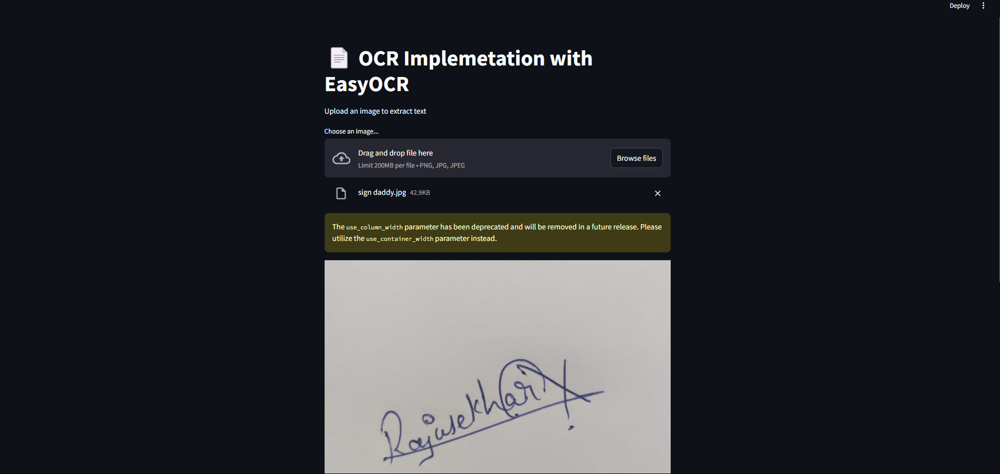

# 📄 OCR Implementation with EasyOCR & Streamlit  

## 🚀 Overview  
This **Streamlit-based OCR (Optical Character Recognition) web app** leverages **EasyOCR** to extract text from images efficiently.  
Simply **upload an image**, and the app will process it in real time, displaying the extracted text with an option to **download it as a text file**.  

## ✨ Features  
✅ **Upload & Process Images** – Supports **PNG, JPG, and JPEG** formats.  
✅ **Real-time Text Extraction** – Uses **EasyOCR** for high-accuracy recognition.  
✅ **Interactive UI** – Streamlit-powered clean and intuitive interface.  
✅ **Download Extracted Text** – Save results effortlessly.  

## 📸 Demo  
  

## 🔧 Installation  

1️⃣ **Clone the repository:**  

git clone https://github.com/YOUR_GITHUB_USERNAME/OCR-Streamlit-App.git
cd OCR-Streamlit-App
2️⃣ Install dependencies:

pip install -r requirements.txt

3️⃣ Run the app:

streamlit run ocr_imp.py

🛠 Technologies Used
Python 🐍

Streamlit 🌐

EasyOCR 🔍

Pillow (PIL) 🖼

📌 Usage
1️⃣ Open the app and upload an image.
2️⃣ The extracted text will be displayed instantly.
3️⃣ Download the text as a .txt file if needed.

🚀 Future Enhancements
🔹 Support for multiple languages 🌎
🔹 Improved text preprocessing for better accuracy 📊
🔹 Integration with databases for text storage 🗄

🔗 Connect with Me

📜 License
This project is open-source under the MIT License.
📩 **Have queries? Let's connect:**   

